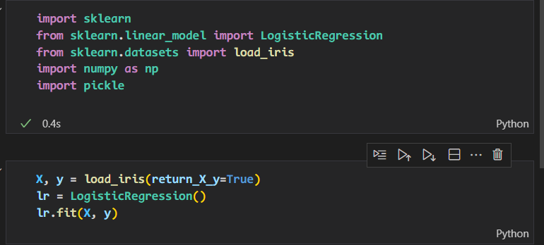
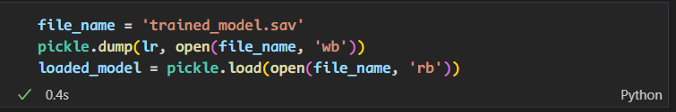
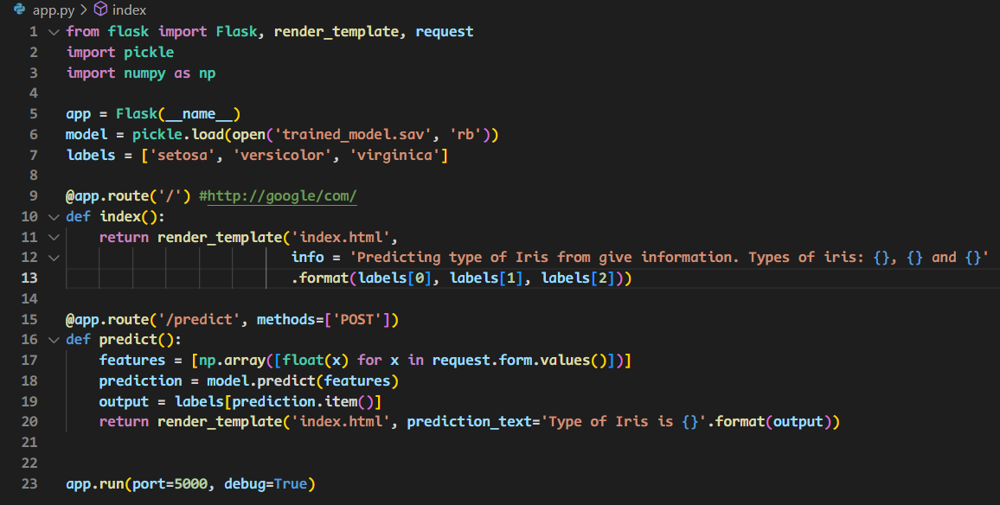
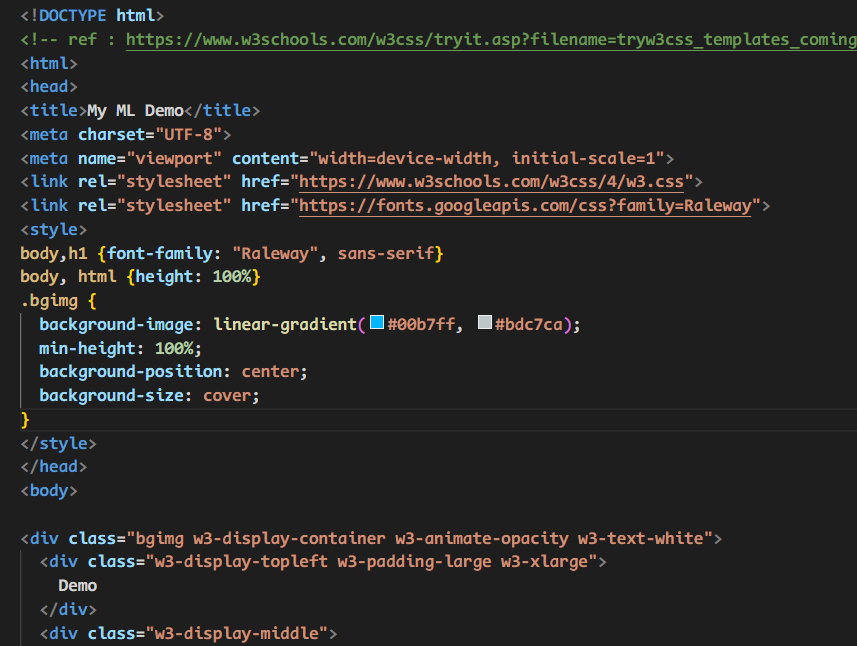
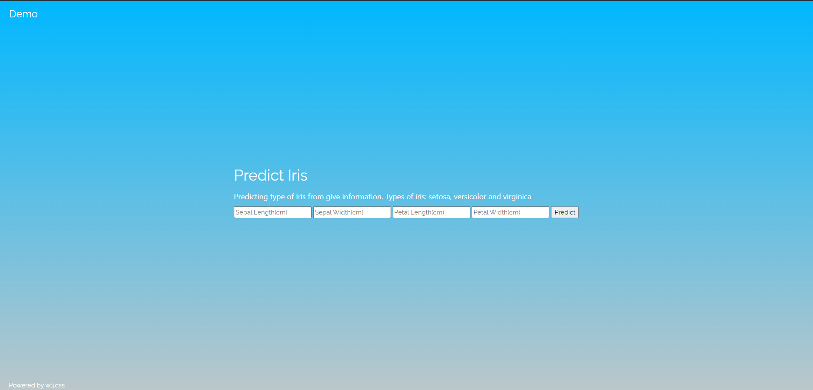
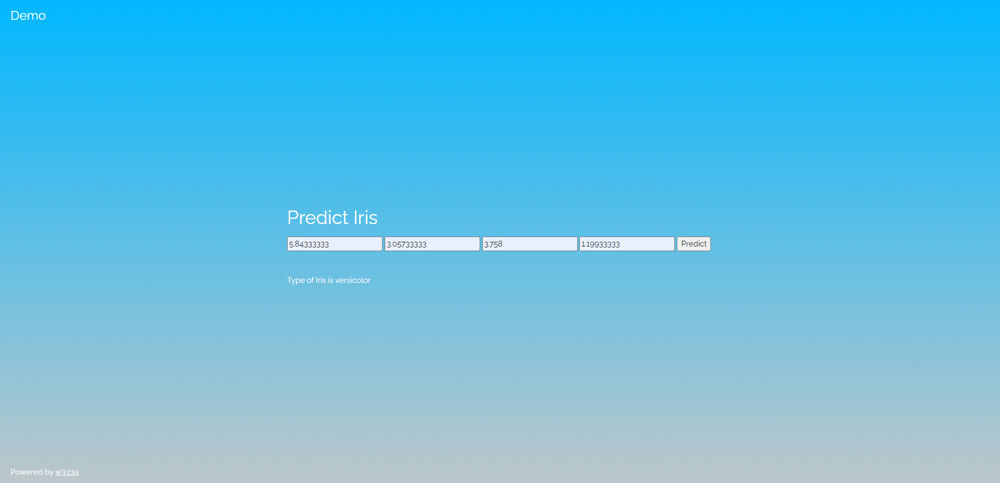

## Info

+ name : Juzheng Shi
+ Batch Code : LISUM 13:30 August - 30 November 2022
+ Submission date: 2022/9/26
+ Submitted to : Week 4 : Deployment on Flask

## Process

1. train a simple model

1. save the model

1. make a simple webpage

1. deploy the model on the web page

1. Done