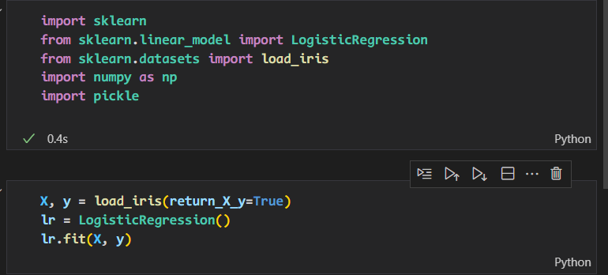
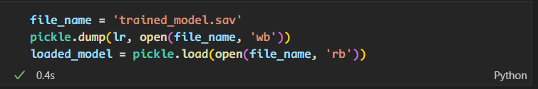
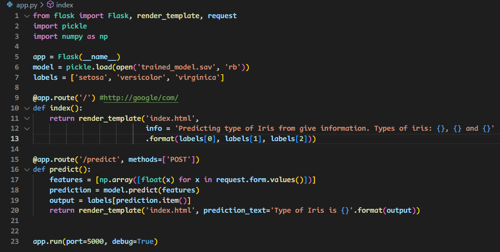
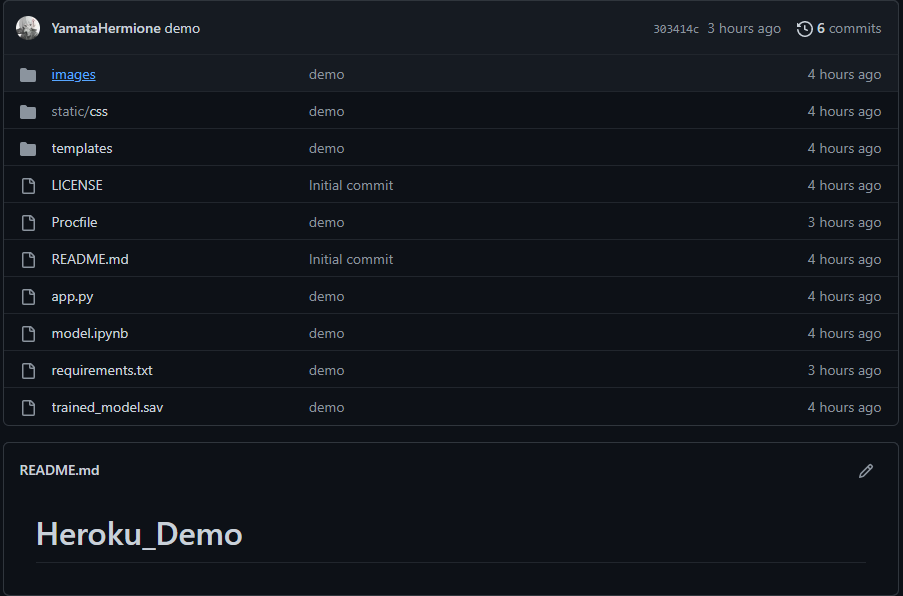
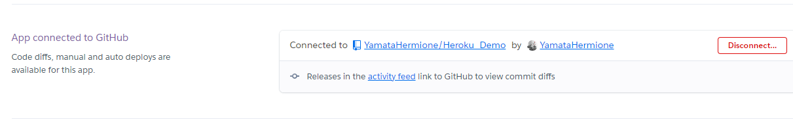
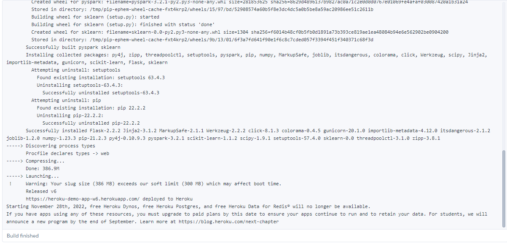
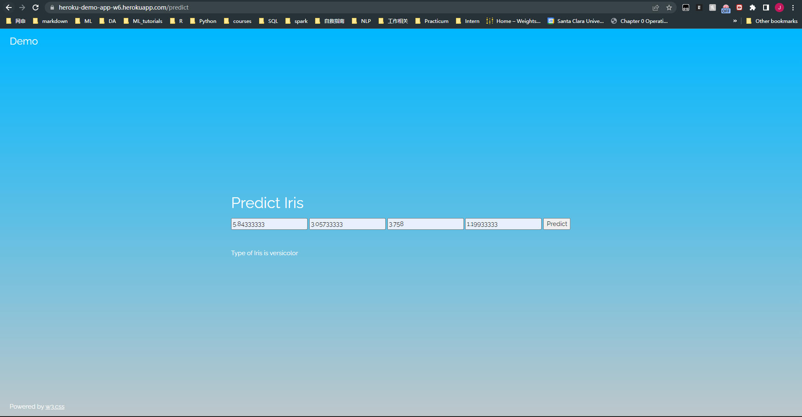

## Info

+ name : Juzheng Shi
+ Batch Code : LISUM 13:30 August - 30 November 2022
+ Submission date: 2022/10/1
+ Submitted to : Week 5 : Cloud and API deployment

1. train a simple model

2. save the model

3. make a web app

4. Deploy the model on Heroku
   1. Create a github repository for heroku app
   
   2. Connect heroku to github
   
   3. Deploy the model
   
5. Done
